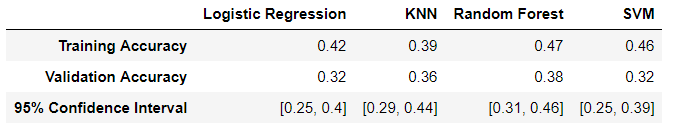
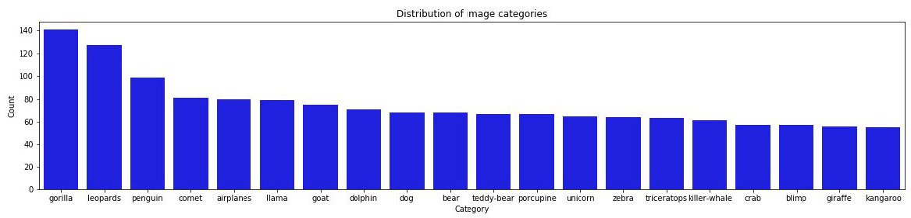

# Building an image classifier from scratch

## Notebooks
This project is split into 4 notebooks. When running for the first time, the notebooks should be opened and ran in sequential order. After all files have been downloaded, they can be opened and executed individually. 
- __NB1: Data cleaning and preparation__
- __NB2a: Preliminary EDA__
- __NB2b: Feature selection__
- __NB3: Modeling__
- __NB4: CNN (in progress)__

## Summary
This project consists of a large dataset with images belonging to 20 different categories.
The goal is to classify the category of a given image using a machine learning model. We are
given 1501 images to train our models, and 716 images to evaluate the model accuracies. We
began by performing exploratory data analyses to give us insights into the feature selection
process. Then, we trained 4 models: Logistic Regression, KNN, SVM and Random Forest. For
each model, we used cross validation to select the best parameters, and a feature selection
function to select the top 10 features. In the end, we identified KNN as the best
model because it has one of the lowest validation errors, a fast computation time and is
relatively easy to interpret. This was completed with Thor Valentin Olesen and Jasper Kan as part
of a project in our graduate data science class.

An implementation of CNN using tensorflow was included in __NB4__ but is very preliminary and will be improved soon.

## Key questions explored
- How well can I design a image classifier using conventional (i.e. non-neural net) ML models?
- How do these model compare to convolutional neural nets? (IN PROGRESS)

## Techniques used
- logistic regression
- KNN
- SVM
- Random forest
- convolutional neural net
- bootstrapping
- cross validation
- feature engineering

## Key findings
- One of the most significant factors that affected model accuracy was the preprocessing of feature values. When normalizing the data, the model performed 10-50% worse compared to models trained on the original data. In contrast, models trained on scaled feature values performed significantly better than the original data.
- Our models achieved a validation accuracy of 40%-46%, with SVM performing the highest (46% accuracy) and KNN performing the lowest (40% accuracy). They also achieved a The 95% confidence interval for SVM was between 38-54%. We selected the Logistic Regression model to predict the test set because it had descent accuracy, is a simple model that’s easy to interpret, and it didn’t overfit the train data as much as some of the other models. We expect this model to generalize best to the test data.
- In this project, we limited our features to numerical values only. However, it is possible to use a pixel by pixel matrix as a feature, which could be significantly improve the final model. Despite the feature constraints presented in this project, we were still able to achieve almost a 50% accuracy on the validation set by focusing our efforts on transforming the data and optimizing model parameters to increase model accuracy. It would be interesting to see how much we could improve the model accuracy by if we combine our data cleaning and parameter optimization efforts in this project with more powerful features.

This image shows a snapshot of the results from different ML models.

This image shows the breakdown of categories in the dataset.

